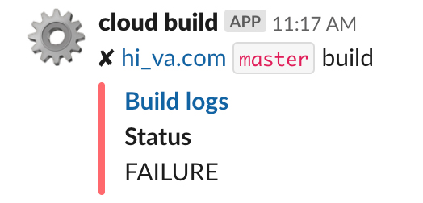
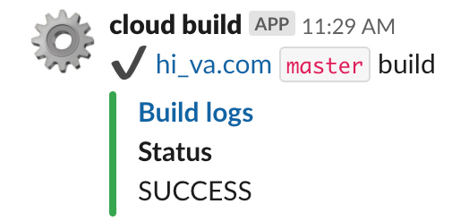

# cloud-functions
Google Cloud functions

## Configuration
```
firebase --project=<PROJECT_ID> functions:config:set webhook.url=<SLACK_WEBHOOK>
```

## Deployment
```
firebase --project=<PROJECT_ID> deploy
```

## Notifications

### Build failure


### Build success
